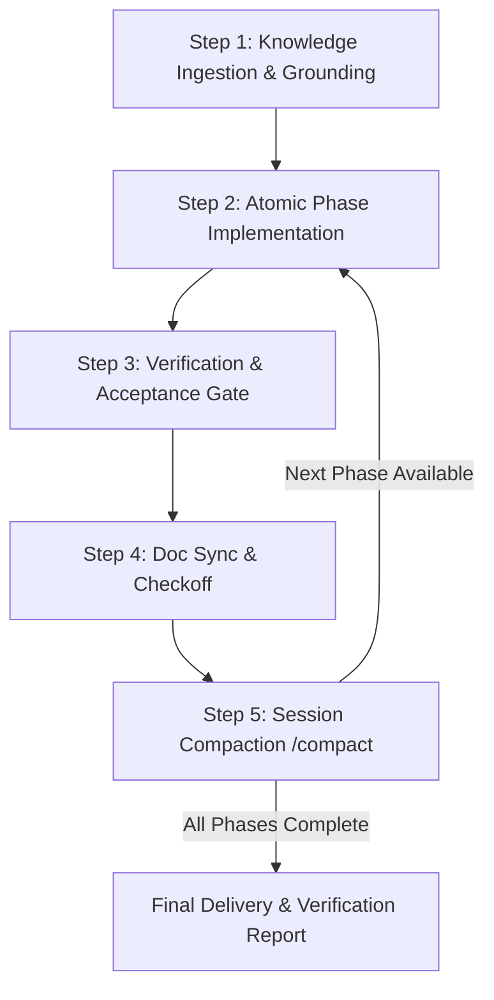

# Implementation Plan Execution & Phase Gate Protocol

## 1. Overview & Core Objective
This protocol governs the autonomous and paired execution of approved **Implementation Plans** (stored as `docs/<topic-slug>/plan.md`, with the companion `docs/<topic-slug>/audit.md` and evidence in `docs/<topic-slug>/data/`, or drafted inline when the user asked for chat-only). It establishes a deterministic, phase-by-phase execution cadence with mandatory knowledge ingestion, acceptance verification, document synchronization, and context compaction (`/compact`) between phases.

---

## 1A. Artifact Location & Storage Contract (BLOCKING)

Canonical definition lives in
[`.agents/rules/plan_and_documentation.md`](plan_and_documentation.md) and is
repeated here because this protocol is often loaded on its own. It overrides
every older convention, including `docs/plans/`.

| Artifact | Path |
| :--- | :--- |
| Implementation plan | `docs/<topic-slug>/plan.md` |
| Audit / analysis report | `docs/<topic-slug>/audit.md` |
| Web-fetched evidence | `docs/<topic-slug>/data/` — created only on the first web fetch |

- `<topic-slug>`: 2–4 lowercase kebab-case words naming the topic, no date
  prefix, no `-plan` / `-report` suffix. Examples: `byok-diagnostics`,
  `light-theme-contrast`, `app-shell-a11y`.
- Never write a plan or audit into `docs/plans/`, `docs/superpowers/` (retired
  2026-09-27), `docs/archive/`, loose in `docs/`, into `.agents/`, `src/`, the project root,
  or under a dated flat filename.
- Every plan and audit opens with `# ` H1 + a `<!-- desc: ... -->` marker on the
  next line, or `bun run docs:sync` fails.
- **Drive boundary (BLOCKING):** plan, audit, and evidence stay inside this
  repository working tree on the project drive (`E:`). Never write to another
  drive or partition, a user profile directory, or the system temp directory;
  move anything worth keeping into the repo before the turn ends. Scratch work
  belongs in `docs/.scratch/`.
- Do not create or move topic folders while executing a plan. The folder is
  created once, when the plan is written.

---

## 2. Trigger Conditions & Initiation
This protocol activates whenever:
- The user gives an approval or execution command (e.g., *"approve"*, *"proceed"*, *"go ahead"*, *"start"*, *"execute Phase 0"*, *"implement the plan"*).
- A newly spawned, resumed, or handoff agent is assigned an existing implementation plan.

---

## 3. The 4-Step Execution Lifecycle

### Step 1: Complete Ingestion & Grounding (Pre-Execution Gate)
Before editing any code or executing any commands, the agent **MUST** ingest the full context of the project topic:
1. **Read the Implementation Plan**: Read `docs/<topic-slug>/plan.md` from top to bottom. Understand the sequence, dependency order, risks, and phase gates.
2. **Read the Companion Audit/Analysis Report**: Read `docs/<topic-slug>/audit.md`. Pay critical attention to:
   - The **Finding Register** (all finding IDs referenced by the plan).
   - Mathematical formulas, tax tables, regulatory citations (IRS, OPM, BLS, CA DIR, DFAS).
   - **Critical Confirmations & "Do Not Fix" List** (prevent false-positive regressions).
3. **Inspect the Evidence & Data Directory**: Review all datasets, mock tables, or test simulation scripts in `docs/<topic-slug>/data/` (e.g., `engine-simulation.mjs`, raw JSON/CSVs).
4. **Inspect Existing Regression Suites**: Check project verification scripts (e.g., `scripts/verify-*.mjs`, test runners) and baseline build status (`bun run build` here).
5. **Declare Initial Target**: State explicitly in chat that ingestion is complete and declare the initial target phase (e.g., *"Ingestion complete. Beginning Phase 0: Ship-blocking defects."*).

---

### Step 2: Hierarchical Phase Execution (Strict Phase Isolation)
Execution proceeds strictly in ascending hierarchical order (**Phase 0 → Phase 1 → Phase 2 → ...**):
- **Single Phase Scope**: Work exclusively on the active phase. **Never combine or skip ahead across multiple phases** in a single run cycle.
- **No Drive-By Refactoring**: Only touch the files, lines, and logic specified by the active phase.
- **Respect Freeze & Sequencing Guards**: If a phase is flagged with a temporal or gating guard (e.g., *"Blocked until Day 30"*, *"Contingent on Lab LCP"*), respect the blocker. Do not execute guarded phases prematurely.

---

### Step 3: Verification & Acceptance Gate
Once changes for the active phase are written, the agent must immediately test and verify:
1. **Run the Narrowest Real Check**: Execute the exact verification script, test suite, or CLI assertion designated for that phase (e.g., `node docs/<topic-slug>/data/engine-simulation.mjs`, `node scripts/verify-hourly-salary-2026.mjs`).
2. **Run Build Verification**: Run `npm run build` (or project equivalent) to ensure zero Astro/Vite/TypeScript compilation or bundle errors. In this repo, `npm` means `bun`: use `bun run build` and `bun run check`.
3. **Check Live Acceptance Criteria**: Validate against every acceptance item explicitly written in that phase's spec.
4. **Hard Invariant**: **No phase may complete with a red harness or failing build.** If verification fails, diagnose and remediate within the phase scope before moving on.

---

### Step 4: Documentation Synchronization & To-Do Checkoff
Immediately after the phase's acceptance gate passes:
1. **Update Checkboxes (`[x]`)**:
   - Open `docs/<topic-slug>/plan.md`.
   - Update all completed action items from `- [ ]` to `- [x]`.
2. **Update Phase Status & Timestamp**:
   - Update the status badge or header for that phase (e.g., `Status: Complete`, date/time of completion).
   - Note any critical metrics, resolved finding IDs, or deviation notes in the document if applicable.
3. **Save and Validate Diff**: Ensure documentation updates are clean, accurate, and reflect the real source state.

---

### Step 5: Session Compaction (`/compact`) & Phase Transition
To maintain context hygiene, prevent token bloat, and avoid model hallucination across long multi-phase tasks:
1. **Issue the `/compact` Command**:
   - Execute or issue the `/compact` directive to compact the conversation session context.
   - Record a clean, concise phase summary:
     - **Decision / Phase Completed**: Exact phase name and findings resolved.
     - **Changes**: List of modified files.
     - **Evidence**: Test/harness output proving 100% pass.
2. **Advance to the Next Hierarchical Phase**:
   - Transition cleanly to the next phase in sequence (e.g., move from Phase 0 to Phase 1).
   - Re-anchor context on the new phase tasks and repeat from **Step 2**.

---

## 4. Phase Execution Matrix & Checklist

| Step | Action Item | Success Indicator |
| :--- | :--- | :--- |
| **0. Ingest** | Ingest plan, audit report, data/ files, and test harnesses | Full understanding of scope, math, and "do not fix" list |
| **1. Isolate** | Lock in current hierarchical phase (e.g., Phase 0) | Zero work done on subsequent or guarded phases |
| **2. Code** | Make surgical edits matching existing style and types | Strict TypeScript, zero lint errors, no unnecessary diffs |
| **3. Verify** | Execute test harness + `npm run build` (`bun run build` here) | Exits 0, all acceptance assertions pass |
| **4. Sync Docs**| Mark `- [x]` in `docs/<topic-slug>/plan.md` & update phase status | Documentation matches code reality 1:1 |
| **5. Compact**| Run `/compact` to reset context overhead | Clean session context ready for next phase |

---

## 5. Golden Rules & Prohibitions
- ❌ **NEVER** edit source code without first reading both `docs/<topic-slug>/plan.md` and `docs/<topic-slug>/audit.md`.
- ❌ **NEVER** create, move, or write a plan, audit, or evidence file into `docs/plans/`, `docs/superpowers/` (retired 2026-09-27), `docs/archive/`, or loose in `docs/`.
- ❌ **NEVER** write any artifact outside this repository working tree on the project drive (`E:`) — no other drive or partition, no user profile directory, no system temp directory.
- ❌ **NEVER** skip verification gates to "save time". Every phase must be proven green.
- ❌ **NEVER** leave `docs/<topic-slug>/plan.md` checkboxes unchecked after completing a phase.
- ❌ **NEVER** execute a phase that is explicitly blocked by a sequencing guard (e.g., Day 30 freeze).
- ❌ **NEVER** proceed to the next phase without compacting the session when completing a major phase.
